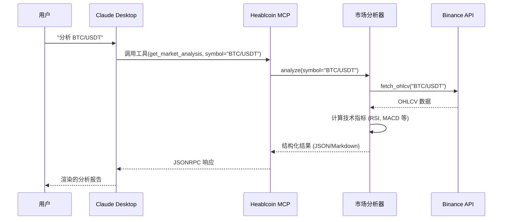
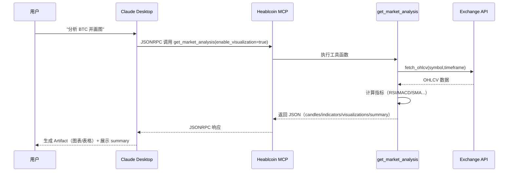

# 架构设计 🏗️

本文档详细介绍 Heablcoin 的模块化架构、数据流和扩展机制。

---

## 1. 总体架构

Heablcoin 遵循 **请求-响应** 模型，通过 **Model Context Protocol (MCP)** 与客户端通信，后端采用模块化引擎处理分析和执行。

```mermaid
graph TD
    Client[Claude Desktop / MCP 客户端] -->|JSONRPC 请求| Server[Heablcoin.py (MCP 服务器)]
    
    subgraph "核心引擎"
        Server --> Router{工具路由}
        Router -->|分析| MktEngine[市场分析引擎]
        Router -->|交易| TradeEngine[交易执行引擎]
        Router -->|个人| PersonalEngine[个人分析引擎]
        Router -->|系统| Sys[系统与日志]
    end
    
    subgraph "外部服务"
        TradeEngine -->|CCXT| Binance[Binance API]
        MktEngine -->|CCXT| Binance
        Sys -->|SMTP| Email[邮件服务器]
    end
    
    subgraph "数据存储"
        PersonalEngine -->|读写| CSV[trade_history.csv]
        MktEngine -->|写入| Reports[reports/]
        Sys -->|写入| Logs[logs/]
    end
```

---

## 2. 请求生命周期（时序图）

以下图表说明用户请求（如"分析 BTC"）的完整处理流程。



---

## 2.1 可视化（Artifact）输出生命周期

当工具支持可视化输出（如 `get_market_analysis(enable_visualization=True)`），服务端会返回结构化 JSON 数据，客户端（Claude Desktop）可基于该数据生成可交互的图表/组件。



### 输出结构（简化版）

当 `enable_visualization=True`，返回 JSON 字符串，核心字段如下：

```json
{
  "symbol": "BTC/USDT",
  "timeframe": "1h",
  "timestamp": "2025-01-01T00:00:00",
  "data": {
    "candles": [{"timestamp": 1700000000000, "open": 0, "high": 0, "low": 0, "close": 0, "volume": 0}],
    "indicators": [{"name": "RSI", "values": [{"timestamp": 1700000000000, "value": 50.0}], "params": {"period": 14}}]
  },
  "visualizations": [{"type": "candlestick", "priority": 1, "title": "BTC/USDT 价格走势"}],
  "summary": "...",
  "_artifact_metadata": {"supports_visualization": true, "recommended_artifact_type": "react"}
}
```

当 `enable_visualization=False`，工具返回传统 Markdown 文本报告（兼容纯文本客户端）。

---

## 3. 目录结构

```
MCP/
├── Heablcoin.py                 # 主入口（MCP 服务器）
├── tests/                       # 测试套件（单元/集成）
│   └── run_tests.py             # 统一测试入口
├── requirements.txt             # Python 依赖
├── .env                         # 配置文件（密钥，不提交）
├── report/
│   └── flexible_report/         # HTML 邮件报告引擎
├── market_analysis/             # 市场分析模块
│   ├── core.py                  # 分析编排器
│   ├── modules/                 # 可插拔分析单元
│   └── indicators/              # 技术指标逻辑
├── personal_analytics/          # 个人账本分析
│   ├── core.py                  # 账本编排器
│   └── modules/                 # 绩效、风险、归因模块
└── docs/                        # 文档
```

---

## 4. 核心子系统

### 4.1 市场分析引擎 (`market_analysis`)

负责生成技术面和情绪面洞察。

*   **`MarketAnalyzer`**: 核心协调器。通过 `DataProvider` 获取数据，调度注册的模块。
*   **模块列表**:
    *   `technical`: RSI、MACD、布林带摘要
    *   `signals`: 综合买卖信号
    *   `sentiment`: 市场情绪评分（恐惧与贪婪）
*   **输出格式**: 支持 Markdown（可读）和 JSON（可视化）

### 4.2 个人分析引擎 (`personal_analytics`)

负责分析用户交易绩效。

*   **`PersonalAnalyzer`**: 读取 `trade_history.csv`
*   **模块列表**:
    *   `portfolio`: 当前持仓和未实现盈亏
    *   `performance`: 胜率、收益率、夏普比率
    *   `risk`: 最大回撤、连续亏损
    *   `attribution`: 按币种/方向归因盈亏

### 4.3 通知与报告系统

解耦的提醒和报告发送系统。

*   **`SmartLogger`**: 多通道日志（交易、系统、错误）
*   **`EmailBuilder`**: HTML 模板引擎，生成精美的邮件报告
*   **通知开关**: 运行时可动态调整各类通知的开启/关闭

---

## 5. 扩展机制

### 新增市场分析模块

1.  在 `market_analysis/modules/` 新建模块文件（如 `new_indicator.py`）
2.  按标准签名实现分析函数：
    ```python
    def analyze_xxx(std_data: Dict, params: Dict) -> Dict:
        return {"name": "xxx", "payload": {...}, "markdown": "..."}
    ```
3.  在 `market_analysis/core.py` 的 `_register_builtin_modules` 方法中注册

### 新增个人分析模块

1.  在 `personal_analytics/modules/` 新建模块文件
2.  按统一签名实现函数：
    ```python
    def analyze_xxx(trades: List[Dict], params: Dict) -> Dict:
        return {"name": "xxx", "payload": {...}, "markdown": "..."}
    ```
3.  在 `personal_analytics/core.py` 的 `AVAILABLE_MODULES` 字典中注册

---

## 6. 设计原则

1.  **安全第一**: 关键操作（交易）受限额 (`MAX_TRADE_AMOUNT`) 和白名单 (`ALLOWED_SYMBOLS`) 保护
2.  **模块化**: 子系统相互隔离，修改通知逻辑不会影响交易逻辑
3.  **可观测性**: 详细的日志和报告确保系统透明
4.  **无 stdout 污染**: MCP 依赖 stdout 通信，所有日志必须输出到 stderr 或文件

---

## 7. 工程约束（MCP 重要）

*   MCP/JSONRPC 通过 stdout 通信
*   **严禁在 server 进程中使用 `print()`**
*   日志应输出到 stderr（本项目已配置 console handler 指向 stderr）
